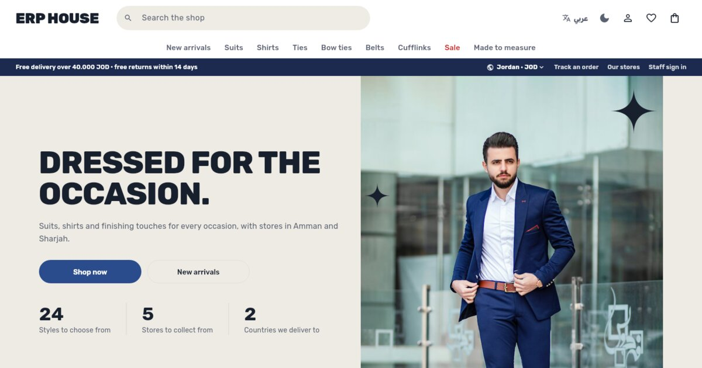
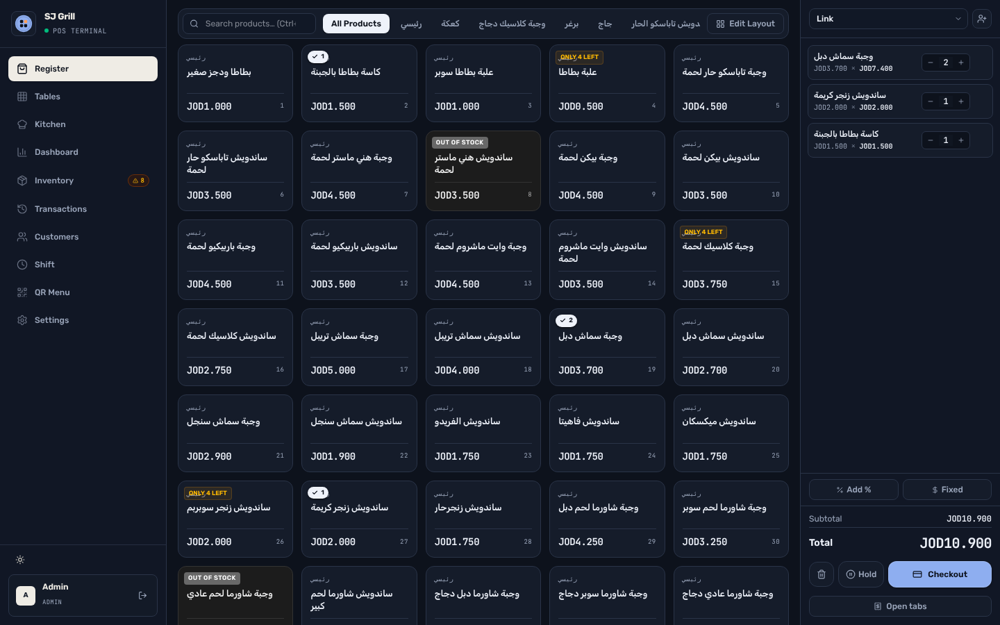
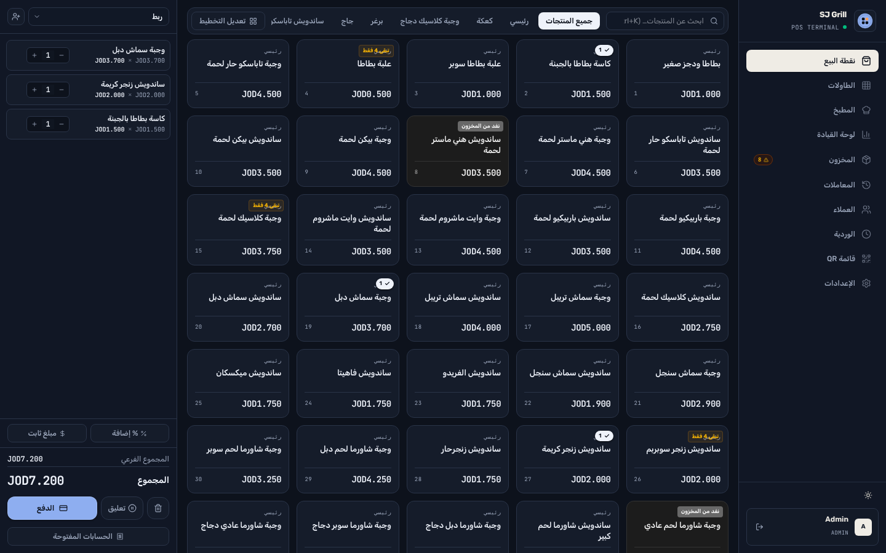

<picture>
  <source media="(prefers-color-scheme: dark)" srcset="assets/brand/arandas-tech-on-dark.png">
  
</picture>

**A software company in Amman, Jordan**

Flutter apps for businesses and agencies · Zirr, our software for shops · Arabic and English

I'm **Ehab Arandas**, a Flutter developer in Amman and the founder of **Arandas Tech** (العرندس للتكنولوجيا), a software company. I have built apps for clients since 2021. Today Arandas Tech does two things:

- **Flutter services:** mobile and web apps for businesses, and a white-label Flutter team for agencies. [See the services](https://arandas.tech/services)
- **Zirr** (زِرّ, "button": the one on a shirt and the one on a screen): our own line of software for shops. The till, the stock behind it, the online store, and the starter we build new apps from. [Meet Zirr](https://arandas.tech/zirr)

## Zirr by Arandas Tech

<picture>
  <source media="(prefers-color-scheme: dark)" srcset="assets/brand/zirr-on-dark.png">
  
</picture>

### Zirr Retail · [see it and buy the code](https://arandas.tech/zirr/retail)

One app that runs a clothing store: the online shop, a till for every branch, stock across stores, buying, customers and the books, on one Supabase database. English and Arabic, light and dark, on the web, Android, iPad and Windows.

- Online shop with live stock per size, checkout, card payments through PayTabs, order tracking and loyalty points
- Point of sale with barcodes, split payments, returns, cash-up and bilingual receipts with Jordan's JoFotara e-invoicing
- Transfers between branches, stock counts, purchase orders, payroll, dashboards and profit and loss
- 39 staff permissions, two-step sign-in, and an AI assistant that writes product descriptions in both languages

[Visit the live shop](https://erp-house.vercel.app) · [Book a back-office walkthrough](https://wa.me/962791568798?text=Hi%2C%20I%20would%20like%20a%20walkthrough%20of%20the%20Zirr%20Retail%20back%20office.) · Get the code: [Developer licence $59](https://www.paypal.com/ncp/payment/PLB-MEBQ9L5YNMRU) · [Agency licence $199](https://www.paypal.com/ncp/payment/873ZSGENBAFQA) ([compare licences](https://arandas.tech/zirr/retail))

`Flutter` `Dart` `Supabase` `PostgreSQL`

### Zirr POS · [live demo](https://pos-sage-one.vercel.app)

Point of sale for shops, cafés and restaurants. Every sale is saved on the device first, so the till keeps selling when the internet drops.

| Register | Arabic menu |
| --- | --- |
|  |  |

- Barcode scanning, size and colour variants, split payments, parked orders and refunds
- Kitchen display, tables and open tabs, and a QR menu for customers' phones
- Receipts on thermal printers, shifts with Z-reports, stock and suppliers

[Try the demo](https://pos-sage-one.vercel.app) (PIN 1234) · In Amman we install it for you: 14-day free trial, then 299 JOD one-off, no monthly fee. [Ask on WhatsApp](https://wa.me/962791568798?text=Hi%20Arandas%20Tech%20team%2C%20I%20would%20like%20a%20free%20Zirr%20POS%20trial.) Developers can buy the code: $199 per shop. [See Zirr POS](https://arandas.tech/zirr/pos)

`React` `TypeScript` `Electron` `Supabase`

### Zirr Boutique · [see it and the licences](https://arandas.tech/zirr/boutique)

A lighter fashion storefront with its own admin panel, for a single brand that only sells online: colour and size variants, promotion codes and Stripe checkout.

[Open the store](https://vanguard-demo-sigma.vercel.app) · Get the code: Regular licence $49 · Extended licence $149 · [Ask on WhatsApp](https://wa.me/962791568798?text=Hi%20Arandas%20Tech%20team%2C%20I%20would%20like%20a%20Zirr%20Boutique%20licence.) ([compare licences](https://arandas.tech/zirr/boutique))

`Flutter Web` `Supabase`

### Zirr Starter

The Flutter and Supabase template every Arandas Tech app starts from: one folder structure, sign-in and roles, Arabic and English with a check for missing translations, row-level security with SQL tests, CI and docs from day one. Agencies get the same structure in every app we hand over.

`Flutter` `GetX` `Supabase`

## What we build for clients

- Mobile apps for Android and iOS, in Flutter
- Web apps and dashboards in React and Flutter Web
- Online stores with a back office
- AI features added to existing products
- Reviews and rescues of Flutter apps that are late, slow or hard to change

Everything ships in Arabic and English, with right-to-left layouts. [Send us a brief](https://wa.me/962791568798?text=Hi%20Arandas%20Tech%20team%2C%20I%20would%20like%20to%20talk%20about%20a%20Flutter%20project.)

## Stack

## بالعربي

**العرندس للتكنولوجيا (Arandas Tech)** شركة برمجيات في عمّان. نبني تطبيقات Flutter للشركات والوكالات، ونصنع **زِرّ**، مجموعتنا من البرامج للمحلات، بالعربي والإنجليزي.

كود **زِرّ للتجزئة** لمحلات الملابس متاح للشراء: متجر إلكتروني وكاشير ومخزون ومشتريات وحسابات في تطبيق واحد. [جرّبه وشاهد الأسعار](https://erp-house.vercel.app/software/ar).

نظام الكاشير **زِرّ كاشير** للمطاعم والكافيهات والمحلات: [جرّب الديمو](https://pos-sage-one.vercel.app)، ونركّبه عندك في عمّان مع تجربة مجانية 14 يوماً، ثم 299 ديناراً مرة واحدة بدون اشتراك شهري.

زُر [موقعنا](https://arandas.tech)، وتابعنا على [فيسبوك](https://www.facebook.com/arandas.tech).

لحجز مكالمة مجانية، راسلنا على [واتساب](https://wa.me/962791568798?text=%D9%85%D8%B1%D8%AD%D8%A8%D8%A7%D9%8B%20%D9%81%D8%B1%D9%8A%D9%82%20%D8%A3%D8%B1%D9%86%D8%AF%D8%B3%20%D8%AA%D9%83%D8%8C%20%D9%88%D8%B5%D9%84%D8%AA%20%D8%A5%D9%84%D9%8A%D9%83%D9%85%20%D9%85%D9%86%20GitHub.).

